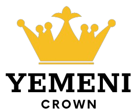
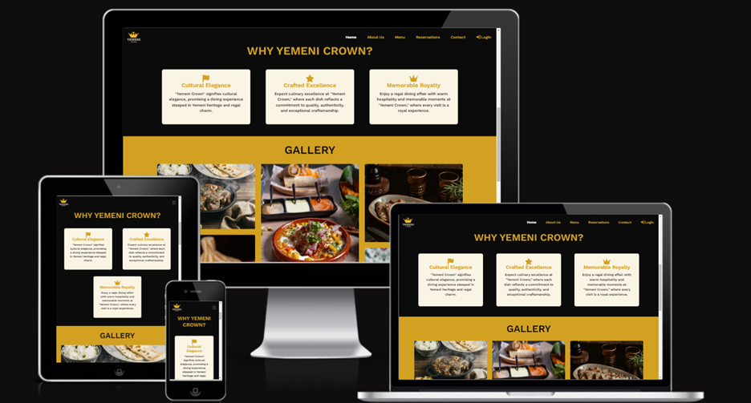
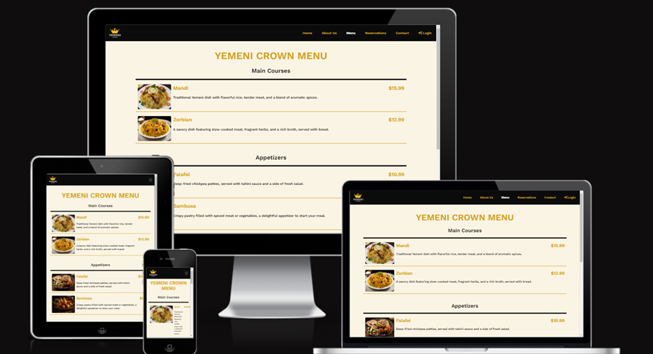
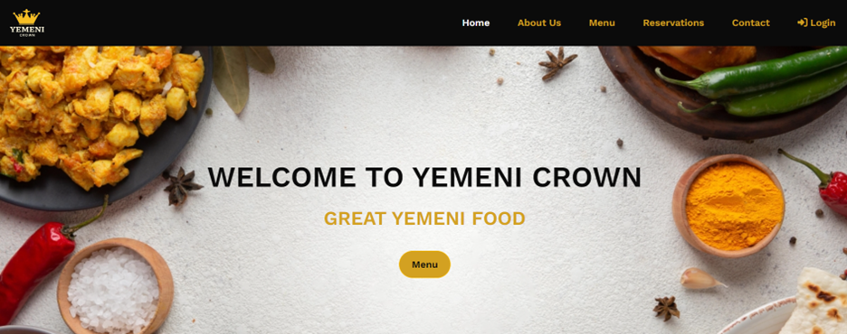
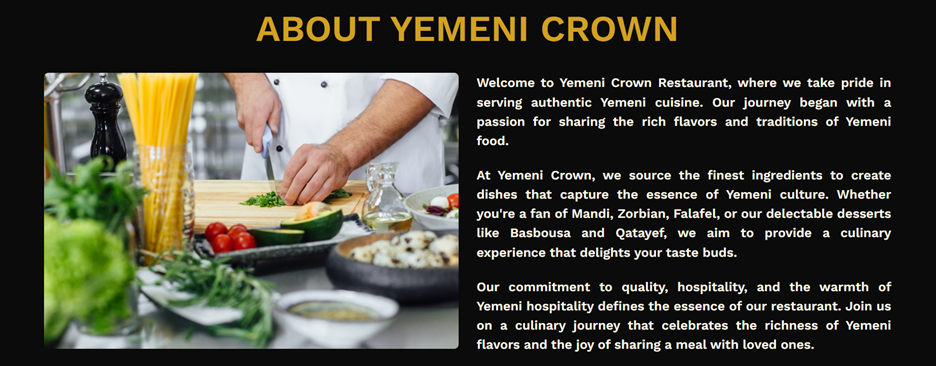
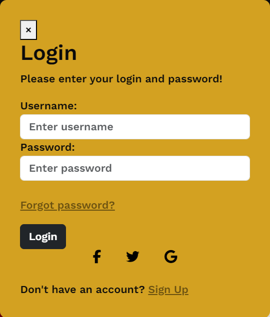
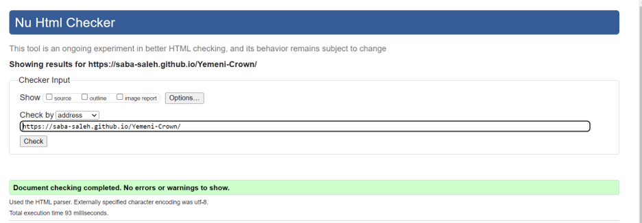

# Yemeni Crown Website 

Welcome to the README for the Yemeni Crown website. This document provides an overview of the project, its features, and instructions on getting started.

## Introduction

The Yemeni Crown website is a platform that showcases the restaurant, its menu, and facilitates reservations. This website aims to provide a delightful online experience for users interested in exploring and engaging with Yemeni Crown.

## Screenshot




## UX and UI

### User Experience Design

In the development of Yemeni Crown, I focused on the following aspects of the 5 planes of UX design:

- **Project and Customer Goals:**
  - Business Goal:
    - Establish an online presence to attract a wider audience and increase brand visibility for Yemeni Crown.
  - User Stories:
    - As a user, I want to easily navigate through the online platform of Yemeni Crown, exploring its visually appealing content, and gaining insights into the restaurant's unique ambiance and offerings. This will allow me to make informed decisions about planning a visit and experiencing the authenticity of Yemeni cuisine.
    - As a customer, I want a simple and efficient reservation process, enhancing my overall dining experience.
    - As a user, I want a secure and convenient login feature to access personalized services.

- **Features:**
  - Responsive Design: Ensures a seamless experience across various devices, including desktops, tablets, and mobile phones.
  - Welcome Section: Engages visitors with a welcoming home page featuring an "Menu" button,which creates a seamless pathway for users to access the menu.
  
  
  - Menu Display: Showcases the restaurant's diverse menu with high-quality images, detailed descriptions, and prices for each dish.
  
  - Reservation Form: Allows users to conveniently make reservations online, providing a user-friendly interface to select preferred date, time, and number of guests.
  
  - Contact and Location: Offers detailed contact information, including a contact form for inquiries, and displays the restaurant's location on an interactive map for easy navigation.
  
  
  - About Yemeni Crown: Provides insights into the rich history and heritage of Yemeni Crown, allowing users to connect with the restaurant on a deeper level.
  
  - Gallery Section: Showcases visually appealing images of the restaurant's signature dishes, creating an appetizing visual experience for users.
  
  - Join Our Mailing List Section: Encourages user engagement by inviting them to subscribe to the mailing list for updates, promotions, and special offers.
  
  - Our Team Section: Introduces the dedicated individuals behind Yemeni Crown, fostering a sense of connection and transparency.
  
  - Bootstrap 5 Navigation Bar: Implements a sleek and responsive navigation bar using Bootstrap 5, enhancing the overall user experience.
  
  - Login Feature: Secure login functionality for users to access personalized services.
  

- **Challenges Faced:**
  - Addressed mobile display issues for optimal user experience.

- **Future Features:**
  - Enhanced user interactivity.
  - Integration of user reviews and feedback.
  - Implement a customer account system for personalized experiences.
  - Implement an online ordering system.
  - Integrate a loyalty program to reward frequent customers.
  - Incorporate social media sharing features to enhance online visibility.
  - Explore the possibility of real-time chat support for customer inquiries.
  - Enhance accessibility features for users with disabilities.
  - Implement a responsive blog section for sharing news, recipes, and restaurant updates.
  - Integration with popular payment gateways for a seamless online payment experience.

- **Information Structure:**
  - Clear navigation with distinct sections for Home, About Us, Menu, Reservations, and Contact.
  - Hierarchical organization for intuitive user flow.

- **Presentation:**
  - Utilization of Bootstrap for a responsive and visually appealing design.
  - Thoughtful color palette reflecting the warmth of Yemen.

- **Look and Feel:**
  - Cultural aesthetics integrated into the design for an immersive experience.
  - Consistent design language contributing to a cohesive user journey.

**Technologies Used:**
- HTML
- CSS (Bootstrap)
- JavaScript


## Wireframes
- **Desktop:**

- **Tablet:**

- **Phone:**


## How to Install and Run the Project
The Yemeni Crown website is deployed to GitHub Pages. To run the project locally, follow these steps:
1. Clone the repository: `git clone https://github.com/SABA-SALEH/Yemeni-Crown`
2. Install dependencies: `npm install`
3. Run the project: `npm start`

## How to Use the Project

Navigate through the following pages:

### Home Page
1. **Welcome Section:**
   - Discover the warmth of Yemeni Crown with a welcoming message.
   - Click the "Menu" button to discover the delightful flavors awaiting you on our dedicated menu page.

2. **Why Yemeni Crown Section:**
   - Dive into the cultural elegance of Yemen, promising a dining experience steeped in heritage and regal charm.

3. **Gallery Section:**
   - Immerse yourself in the visual delights of Yemeni Crown with our captivating gallery.

4. **Join Our Mailing List Section:**
   - Stay updated with the latest offerings and promotions by subscribing to our mailing list.

5. **Login Button:**
   - Securely log in to access personalized services and features.

### About Us Page
1. **About Yemeni Crown Section:**
   - Learn about the story behind Yemeni Crown and our commitment to cultural excellence.

2. **Our Team Section:**
   - Meet the passionate individuals behind the scenes who bring Yemeni Crown to life.

### Menu Page
- Discover the rich variety of Yemeni dishes, each presented with detailed descriptions, prices, and enticing images.

### Reservation Page
- Experience hassle-free reservations with our easy-to-use reservation system.

### Contact Page
- Reach out to us through our contact form, and find our location on the map for easy navigation.


## Deployment

This Yemeni Crown website project was developed using the CodeAnywhere IDE, committed to Git, and pushed to GitHub.

### Deploying to GitHub Pages

To deploy this page to GitHub Pages from its GitHub repository, follow these steps:

1. Log into GitHub.
2. From the list of repositories on the screen, select `SABA-SALEH/Yemeni-Crown`.
3. From the menu items near the top of the page, select **Settings**.
4. Scroll down to the **GitHub Pages** section.
5. Under **Source**, click the drop-down menu labeled **None** and select **Master Branch**.
6. After selecting the **Master Branch**, the page is automatically refreshed, and the website is now deployed.
7. Scroll back down to the GitHub Pages section to retrieve the link to the deployed website.

At the moment of submitting this project, the Development Branch and Master Branch are identical.

### How to Run This Project Locally

#### Cloning the Project from GitHub to CodeAnywhere

To clone this project from GitHub to CodeAnywhere:

1. Open your CodeAnywhere IDE.
2. Create a new container or open an existing one.
3. In the terminal, type `git clone https://github.com/SABA-SALEH/Yemeni-Crown.git`.
4. Press Enter. Your CodeAnywhere workspace is now set up with the project code.

#### Running Locally in CodeAnywhere

1. Once the project is cloned, navigate to the project directory.
2. Open the `index.html` file in the IDE.
3. Right-click on the file and choose **Preview** to view the project locally in CodeAnywhere.

#### Running Locally in a Local IDE (Optional)

To run this project in a local IDE like Visual Studio Code, PyCharm, etc.:

1. Follow this link to the Project GitHub repository: [Yemeni Crown GitHub Repository](https://github.com/SABA-SALEH/Yemeni-Crown).
2. Under the repository name, click **Code**.
3. In the **Clone with HTTPS** section, copy the clone URL for the repository.
4. In your local IDE, open the terminal.
5. Change the current working directory to the location where you want the cloned directory to be made.
6. Type `git clone`, and then paste the URL you copied in Step 3.

## Testing

The Yemeni Crown website underwent extensive testing to ensure a robust and user-friendly experience. The testing process included the following steps:

### Manual Testing
- **Cross-browser Testing:** The website was tested on popular browsers such as Chrome, Firefox, Safari, and Edge to ensure compatibility.
- **Responsive Design Testing:** Manual testing was conducted on various devices, including desktops, tablets, and smartphones, to verify responsiveness.
  
- **User Story Validation:** Each user story outlined in the UX section was manually tested to ensure that users could achieve their goals effectively.
- **Navigation Testing:** All navigation elements, including links and buttons, were thoroughly tested to ensure a seamless browsing experience.

### Automated Testing
- **Code Validation:** Online validators for HTML, CSS, and JavaScript were used to validate the code against industry standards.


The errors and  warnings are originating from Bootstrap 5. 
- **Lighthouse Audit:** Chrome DevTools Lighthouse was employed to assess performance, best practices, accessibility, and SEO, resulting in optimizations.

 
 
 


### Client Stories Testing

The following scenarios were tested to ensure a smooth user experience:

1. **Navigation Testing:**
   - Users can effortlessly navigate the site from the home page to the About Us, Menu, Reservations, Contact  and Login pages.
   - The "Menu" button on the home page directs users to the menu page.

2. **About Us Page Testing:**
   - The About Us page provides concise and engaging information about Yemeni Crown, its history, and cultural significance.
   - Users can easily find the team section to learn about the passionate individuals behind Yemeni Crown.

3. **Menu Page Testing:**
   - Users can access the menu page from the home page to explore the rich variety of Yemeni dishes.
   - Each menu item is presented with detailed descriptions, prices, and enticing images.

4. **Reservation Page Testing:**
   - The reservation page offers a user-friendly form for hassle-free table reservations.
   - Users can conveniently select preferred date, time, and party size.

5. **Contact Page Testing:**
   - Users can reach out to Yemeni Crown through the contact form on the Contact page.
   - Location information and an interactive map are provided for easy navigation.

6. **Login Feature Testing:**
   - The login feature securely allows registered users to access personalized services, enhancing their overall experience.

These tests were conducted to ensure that the Yemeni Crown website meets high standards for usability, performance, and reliability.

## Bugs and Fixes

### Navigation Bar on Small Screens

#### Issue:
In the earlier stages of development, I encountered a challenge related to the navigation bar's responsiveness, particularly on smaller screens. The collapsible menu was not functioning correctly, leading to accessibility issues and an inconsistent user experience.

#### Troubleshooting Steps
I followed a systematic approach to identify and resolve the issue:

1. **Code Review:** Carefully reviewed the HTML and CSS related to the navigation bar, checking for any syntax errors or misconfigurations.
2. **Bootstrap Documentation:** Consulted the Bootstrap documentation specifically related to the navbar and collapsible behavior to ensure alignment with best practices.
3. **Browser DevTools:** Utilized browser developer tools to inspect the rendered HTML and CSS, identifying any unexpected behavior or conflicts.


#### Solution:
Adjusted the Bootstrap navigation bar breakpoint and added custom CSS to ensure a responsive and user-friendly navigation experience on smaller devices.

```html
<!-- Updated Bootstrap Navbar -->
 <nav class="navbar navbar-expand-lg navbar-dark fixed-top" >
      <a class="navbar-brand"  href="index.html">
      
      </a>

      <button
        class="navbar-toggler"
        type="button"
        data-bs-toggle="collapse"
        data-bs-target="#navbarNav"
        aria-controls="navbarNav"
        aria-expanded="false"
        aria-label="Toggle navigation">
        <span class="navbar-toggler-icon"></span>
      </button>

  <!-- Navbar content -->
  <!-- ... -->
</nav>
```

```css
.fixed-top {
    position: fixed;
    top: 0;
    width: 100%;
    z-index: 1000;
}

```

### Responsive Cards in "Why Yemeni Crown" & "Our Team" Sections

#### Issue:
While working on the "Why Yemeni Crown" and "Our Team" sections, I observed that the cards were not responsive enough. On smaller screens, the content was either getting cut off or not displaying correctly, affecting the overall visual appeal and user experience.

#### Solution:
Implemented adjustments to the card styles and structure to enhance responsiveness on smaller screens. Utilized Bootstrap utility classes and custom CSS to ensure optimal display across a range of devices.

```css
/* Responsive Styles */
@media (max-width: 768px) {
    .about-section2 .col-md-4 {
        margin-bottom: 10px;}
}

@media (max-width: 992px) {

    .about-section2 .card {
        padding: 20px;
        max-width: 600px;
        margin: 20px auto;
    }

    .about-section2 h4 {
        font-size: 1.2em;
    }

    .about-section2 p {
        font-size: 0.8em;
    }
}
```

## Credits
- Gallery images sourced from [Freepik](https://www.freepik.com/)
- Login popup script inspired by [CodePal](https://codepal.ai/live-webpage-generator/query/eAwuGTHS/html-css-javascript-login-button)
- Project developed by SABA SALEH
- Logo designed using [Canva](https://www.canva.com/)
- Optimize images using [Image Optimizer](http://www.imageoptimizer.net/)
- Navigation bar built with [Bootstrap 5](https://getbootstrap.com/)
- Gallery section inspired by [MDBootstrap](https://mdbootstrap.com/docs/standard/extended/gallery/)


## Contributing
If you'd like to contribute to the Yemeni Crown website, feel free to fork the repository and submit a pull request. For bug reports or feature requests, please open an issue on the GitHub repository.
