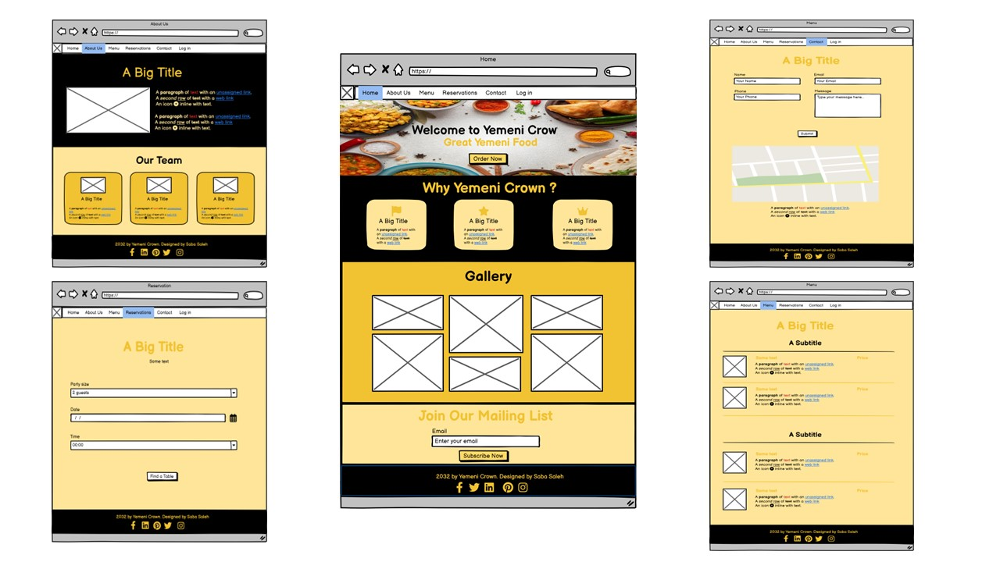

# Yemeni Crown Website

Welcome to the README for the Yemeni Crown website. This document provides an overview of the project, its features, and instructions on getting started.

## Introduction

The Yemeni Crown website is a platform that showcases the restaurant, its menu, and facilitates reservations. This website aims to provide a delightful online experience for users interested in exploring and engaging with Yemeni Crown.

## UX and UI

### User Experience Design

In the development of Yemeni Crown, I focused on the following aspects of the 5 planes of UX design:

- **Project and Customer Goals:**
  - Business Goal:
    - Establish an online presence to attract a wider audience and increase brand visibility for Yemeni Crown.
  - User Stories:
    - As a user, I want to discover authentic Yemeni dishes and learn about their cultural significance.
    - As a customer, I want a simple and efficient reservation process, enhancing my overall dining experience.
    - As a potential customer, I want a straightforward online ordering system to enjoy Yemeni cuisine from the comfort of my home.
    - As a user, I want a secure and convenient login feature to access personalized services.

- **Features:**
  - Responsive Design: Ensures a seamless experience across various devices, including desktops, tablets, and mobile phones.
  - Menu Display: Showcases the restaurant's diverse menu with high-quality images, detailed descriptions, and prices for each dish.
  - Reservation Form: Allows users to conveniently make reservations online, providing a user-friendly interface to select preferred date, time, and number of guests.
  - Contact and Location: Offers detailed contact information, including a contact form for inquiries, and displays the restaurant's location on an interactive map for easy navigation.
  - Welcome Section: Engages visitors with a welcoming home page featuring an "Order Online" button, creating a smooth pathway for online orders.
  - About Yemeni Crown: Provides insights into the rich history and heritage of Yemeni Crown, allowing users to connect with the restaurant on a deeper level.
  - Gallery Section: Showcases visually appealing images of the restaurant's signature dishes, creating an appetizing visual experience for users.
  - Join Our Mailing List Section: Encourages user engagement by inviting them to subscribe to the mailing list for updates, promotions, and special offers.
  - Our Team Section: Introduces the dedicated individuals behind Yemeni Crown, fostering a sense of connection and transparency.
  - Bootstrap 5 Navigation Bar: Implements a sleek and responsive navigation bar using Bootstrap 5, enhancing the overall user experience.
  - Gallery Section Implementation: Utilizes the Bootstrap Gallery component, providing an interactive and visually appealing way to display multiple images.
  - Login Feature: Secure login functionality for users to access personalized services.

- **Challenges Faced:**
  - Addressed mobile display issues for optimal user experience.

- **Future Features:**
  - Enhanced user interactivity
  - Integration of user reviews and feedback

- **Information Structure:**
  - Clear navigation with distinct sections for Home, About Us, Menu, Reservations, and Contact.
  - Hierarchical organization for intuitive user flow.

- **Presentation:**
  - Utilization of Bootstrap for a responsive and visually appealing design.
  - Thoughtful color palette reflecting the warmth of Yemen.

- **Look and Feel:**
  - Cultural aesthetics integrated into the design for an immersive experience.
  - Consistent design language contributing to a cohesive user journey.

**Technologies Used:**
- HTML
- CSS (Bootstrap)
- JavaScript

## Wireframes
- **Desktop:**

- **Tablet:**

- **Phone:**

## How to Install and Run the Project
The Yemeni Crown website is deployed to GitHub Pages. To run the project locally, follow these steps:
1. Clone the repository: `git clone https://github.com/SABA-SALEH/Yemeni-Crown`
2. Install dependencies: `npm install`
3. Run the project: `npm start`

## How to Use the Project
Navigate through the following pages:

## How to Use the Project

Navigate through the following pages:

### Home Page
1. **Welcome Section:**
   - Discover the warmth of Yemeni Crown with a welcoming message.
   - Explore the "Order Online" button to experience the convenience of online ordering.

2. **Why Yemeni Crown Section:**
   - Dive into the cultural elegance of Yemen, promising a dining experience steeped in heritage and regal charm.

3. **Gallery Section:**
   - Immerse yourself in the visual delights of Yemeni Crown with our captivating gallery.

4. **Join Our Mailing List Section:**
   - Stay updated with the latest offerings and promotions by subscribing to our mailing list.

5. **Login Button:**
   - Securely log in to access personalized services and features.

### About Us Page
1. **About Yemeni Crown Section:**
   - Learn about the story behind Yemeni Crown and our commitment to cultural excellence.

2. **Our Team Section:**
   - Meet the passionate individuals behind the scenes who bring Yemeni Crown to life.

### Menu Page
- Discover the rich variety of Yemeni dishes, each presented with detailed descriptions, prices, and enticing images.

### Reservation Page
- Experience hassle-free reservations with our easy-to-use reservation system.

### Contact Page
- Reach out to us through our contact form, and find our location on the map for easy navigation.

## Deployment

This Yemeni Crown website project was developed using the CodeAnywhere IDE, committed to Git, and pushed to GitHub.

### Deploying to GitHub Pages

To deploy this page to GitHub Pages from its GitHub repository, follow these steps:

1. Log into GitHub.
2. From the list of repositories on the screen, select `SABA-SALEH/Yemeni-Crown`.
3. From the menu items near the top of the page, select **Settings**.
4. Scroll down to the **GitHub Pages** section.
5. Under **Source**, click the drop-down menu labeled **None** and select **Master Branch**.
6. After selecting the **Master Branch**, the page is automatically refreshed, and the website is now deployed.
7. Scroll back down to the GitHub Pages section to retrieve the link to the deployed website.

At the moment of submitting this project, the Development Branch and Master Branch are identical.

### How to Run This Project Locally

#### Cloning the Project from GitHub to CodeAnywhere

To clone this project from GitHub to CodeAnywhere:

1. Open your CodeAnywhere IDE.
2. Create a new container or open an existing one.
3. In the terminal, type `git clone https://github.com/SABA-SALEH/Yemeni-Crown.git`.
4. Press Enter. Your CodeAnywhere workspace is now set up with the project code.

#### Running Locally in CodeAnywhere

1. Once the project is cloned, navigate to the project directory.
2. Open the `index.html` file in the IDE.
3. Right-click on the file and choose **Preview** to view the project locally in CodeAnywhere.

#### Running Locally in a Local IDE (Optional)

To run this project in a local IDE like Visual Studio Code, PyCharm, etc.:

1. Follow this link to the Project GitHub repository: [Yemeni Crown GitHub Repository](https://github.com/SABA-SALEH/Yemeni-Crown).
2. Under the repository name, click **Code**.
3. In the **Clone with HTTPS** section, copy the clone URL for the repository.
4. In your local IDE, open the terminal.
5. Change the current working directory to the location where you want the cloned directory to be made.
6. Type `git clone`, and then paste the URL you copied in Step 3.

## Testing

The Yemeni Crown website underwent thorough testing to ensure a seamless user experience. The testing process included:

- Manual testing on different screen sizes and browsers.
- Verification of responsiveness.
- Validation of user stories defined in the UX section.
- Utilization of online validators for HTML, CSS, and JavaScript.
- Lighthouse in Chrome DevTools for performance, best practices, and accessibility.
